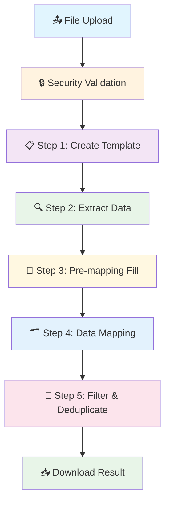

# Excel Template Converter - TSS Converter System

## 🎯 Tổng quan
Hệ thống Python chuyên nghiệp để chuyển đổi Excel files từ format tùy ý sang template chuẩn TSS (Technical Specification System). Bao gồm 5-step automated pipeline với Streamlit web interface, comprehensive validation, error handling robust và security features.

## ⚡ Chức năng chính
- **5-step automated pipeline**: Template → Extract → Pre-mapping Fill → Data Mapping → Filter & Deduplicate
- **Web Interface**: Streamlit-based với real-time progress tracking
- **Security framework** với file validation và secure session management
- **Robust error handling** với custom exceptions và graceful degradation
- **File format validation** strict (.xlsx only, max 50MB)
- **Session-based processing** với temporary file management
- **Professional output** với standardized filename format

## 🏗️ Kiến trúc hệ thống

### Core Components
```
TSS Converter/
├── 🌐 Web Interface
│   ├── app.py                    # Main Streamlit application
│   ├── ui_components.py          # Reusable UI components
│   ├── config_streamlit.py       # Streamlit configuration
│   └── streamlit_pipeline.py     # Pipeline integration
│
├── 🛠️ Processing Pipeline
│   ├── step1_template_creation.py    # Template generation với formatting
│   ├── step2_data_extraction.py      # Article data extraction từ source
│   ├── step3_pre_mapping_fill.py     # Pre-mapping data fill và business logic
│   ├── step4_data_mapping.py         # Data mapping với business logic
│   ├── step5_filter_deduplicate.py   # NA filtering và SD deduplication
│   └── step6_article_crossref.py     # Article cross-reference (optional)
│
├── 🔧 Common Utilities
│   ├── common/config.py          # Configuration management
│   ├── common/exceptions.py      # Custom exception framework
│   ├── common/validation.py      # File & structure validation
│   ├── common/security.py        # Security utilities
│   ├── common/session_manager.py # Session state management
│   ├── common/error_handler.py   # Error handling utilities
│   └── common/quality_reporter.py # Quality reporting
│
├── 📊 Configuration & Data
│   ├── requirements.txt          # Dependencies
│   ├── runtime.txt              # Python version
│   ├── input/                   # Sample input files
│   ├── output/                  # Generated output files
│   └── temp/                   # Temporary session files
│
└── 📖 Documentation
    ├── CLAUDE.md                # Main documentation (this file)
    ├── README_STREAMLIT.md      # Streamlit setup guide
    ├── YEU_CAU_FILE_INPUT.md   # Input file requirements
    ├── SECURITY_FIXES_SUMMARY.md # Security implementation
    └── START_WEBAPP.md         # Quick start guide
```

### Processing Pipeline Flow


## 🔧 Yêu cầu kỹ thuật

### Dependencies
```python
streamlit>=1.28.0,<1.30.0  # Web interface framework
openpyxl>=3.0.0,<4.0.0     # Excel file processing
pathlib                    # File path handling (built-in)
logging                    # Logging system (built-in)
json                       # Configuration files (built-in)
typing                     # Type hints (built-in)
tempfile                   # Temporary file management (built-in)
shutil                     # File operations (built-in)
```

### System Requirements
- **Python**: 3.8+ (specified in runtime.txt)
- **File Format**: Excel .xlsx files only (strict validation)
- **File Size**: Maximum 50MB per upload
- **Memory**: Minimum 1GB RAM for large datasets
- **Storage**: 200MB+ free space for temporary files
- **Network**: For Streamlit web interface access

### Browser Support
- ✅ Chrome 90+
- ✅ Firefox 88+
- ✅ Safari 14+
- ✅ Edge 90+

## 📊 Pipeline Steps Detail

### Step 1: Template Creation 📋
**File**: `step1_template_creation.py`
**Duration**: 2-5 seconds

**Function**: Tạo standardized 17-column template
**Input**: Any .xlsx file
**Output**: Template với headers và formatting chuẩn

**Template Headers (A-Q)**:
1. **Combination** (Yellow background)
2. **General Type Component(Type)** (Red background, white text)
3. **Sub-Type Component Identity Process Name** (Red background)
4. **Material Designation** (Red background)
5. **Material Distributor** (Red background)
6. **Producer** (Red background)
7. **Material Type In Process** (Red background)
8. **Document type** (Blue background, white text)
9. **Requirement Source/TED** (Blue background)
10. **Sub-type** (Blue background)
11. **Regulation or substances** (Blue background)
12. **Limit** (Light green background)
13. **Test method** (Light green background)
14. **Frequency** (Light green background)
15. **Level** (Blue background, white text)
16. **Warning Limit** (Light green background)
17. **Additional Information** (Light green background)

### Step 2: Data Extraction 🔍
**File**: `step2_data_extraction.py`
**Duration**: 10-30 seconds

**Function**: Extract article names và numbers từ source files
**Search Headers**:
- Names: `Product name`, `Article name` (case-insensitive)
- Numbers: `Product number`, `Article number` (case-insensitive)

**Features**:
- Multi-value cell parsing (`;`, `,`, `\n` delimiters)
- Automatic duplicate removal
- Trailing punctuation cleanup
- M-Textile specific processing logic

### Step 3: Pre-mapping Fill 📝
**File**: `step3_pre_mapping_fill.py`
**Duration**: 5-15 seconds

**Function**: Pre-processing data fill using vertical inheritance
**Logic**: Fill empty cells with values from cells above
**Target Columns**: D, E, F
**Start Row**: 4 (after headers)

### Step 4: Data Mapping 🗂️
**File**: `step4_data_mapping.py`
**Duration**: 15-45 seconds

**Function**: Map data theo business logic
**Business Rules**:
- **Finished Product sheets**: Special column mapping (C→D, H→F, K+L→I, etc.)
- **Other sheets**: General mapping (I→D, J→F, N+O→I, etc.)
- **Sheet Detection**: Keyword-based (`finished product`) + content-based (>10 rows)
- **Column Combination**: Multiple columns joined với `-` delimiter

### Step 5: Filter & Deduplicate 🎯
**File**: `step5_filter_deduplicate.py`
**Duration**: 10-20 seconds

**Function**: Five-stage filtering process:
1. **NA Filtering**: Remove rows với Column H = `""`, `"NA"`, `"-"`
2. **SD Duplicate Detection**: Find SD groups by columns B,C,D,E,F,I,J similarity
3. **SD Data Clearing**: Clear columns K,L,M for all SD rows
4. **SD Deduplication**: Keep first occurrence, remove duplicates
5. **Column O Cleaning**: Convert "NA" values in column O to empty

## 🌐 Web Interface Features

### Streamlit Application (`app.py`)
- **Responsive design** với modern UI components
- **Real-time progress tracking** với step-by-step indicators
- **File upload validation** với security checks
- **Session management** với temporary file handling
- **Error handling** với user-friendly messages
- **Download management** với secure filename generation

### UI Components (`ui_components.py`)
- **File upload area** với validation
- **Progress indicators** với estimated time
- **Download section** với custom filename format
- **Error/success messaging** system
- **Help section** với usage instructions

### Configuration (`config_streamlit.py`)
```python
STREAMLIT_CONFIG = {
    "max_file_size_mb": 50,
    "security_mode": "lenient",
    "enable_fallback_validation": True,
    "session_timeout_hours": 24,
    "cleanup_interval_hours": 1
}

STEP_CONFIG = {
    "step1": {"name": "Create Template", "estimated_time": "2-5 seconds"},
    "step2": {"name": "Extract Data", "estimated_time": "10-30 seconds"},
    "step3": {"name": "Pre-mapping Fill", "estimated_time": "5-15 seconds"},
    "step4": {"name": "Data Mapping", "estimated_time": "15-45 seconds"},
    "step5": {"name": "Filter & Deduplicate", "estimated_time": "10-20 seconds"}
}
```

## 🔒 Security Features

### File Validation
- **Format validation**: .xlsx only với MIME type verification
- **Size validation**: 50MB limit với strict enforcement
- **Content validation**: Excel structure integrity checks
- **Path validation**: Secure file path handling
- **Malware scanning**: Basic file signature validation

### Session Security
- **Unique session IDs**: Cryptographically secure generation
- **Temporary file isolation**: Session-based file separation
- **Auto-cleanup**: Automatic removal of old sessions (24h)
- **Access control**: Secure file permissions (0o600)

### Error Handling
```python
TSConverterError                 # Base exception
├── ValidationError              # Input validation failures
│   ├── FileFormatError         # Invalid file format
│   ├── WorksheetNotFoundError  # Missing worksheets  
│   └── ColumnMissingError      # Missing required columns
├── DataIntegrityError          # Data quality issues
├── ProcessingError             # Runtime processing errors
├── SecurityError               # Security violations
└── ConfigurationError          # Configuration issues
```

## 🚀 Usage Examples

### Web Interface Usage
1. **Access**: Open `http://localhost:8501` (or deployed URL)
2. **Upload**: Drag & drop .xlsx file (max 50MB)
3. **Process**: Click "🚀 Start Conversion" và wait for completion
4. **Download**: Click download button để get result

### CLI Usage (Alternative)
```bash
# Step 1: Create template
python step1_template_creation.py input.xlsx

# Step 2: Extract data
python step2_data_extraction.py output/input-Step1.xlsx -s source_data.xlsx

# Step 3: Pre-mapping fill
python step3_pre_mapping_fill.py source_data.xlsx output/input-Step2.xlsx

# Step 4: Data mapping
python step4_data_mapping.py source_data.xlsx output/input-Step2.xlsx output/input-Step3.xlsx

# Step 5: Filter and deduplicate
python step5_filter_deduplicate.py output/input-Step4.xlsx
```

### Filename Format
- **Web Interface**: `{original_name}_Converted_YYYYMMDD.xlsx`
- **Fallback**: `TSS_Converted_YYYYMMDD.xlsx`
- **Examples**:
  - `input-1.xlsx` → `input-1_Converted_20260103.xlsx`
  - `Test plan.xlsx` → `Test plan_Converted_20260103.xlsx`

## 📁 Input File Requirements

### Required Structure
- **File Format**: `.xlsx` only (Excel 2007+)
- **File Size**: Maximum 50MB
- **Required Headers**: `Product name` + `Article number` (or variations)
- **Data Structure**: Headers với data rows immediately below

### Supported Variations
- `Product name`, `Article name`, `product_name`, `article_name`
- `Product number`, `Article number`, `product_number`, `article_number`
- Case-insensitive header matching
- Multiple worksheets support (auto-detection)
- Multi-value cells với delimiters: `;`, `,`, `\n`

### Data Quality
- Minimum 1 product với valid name và number
- Headers must be present in first 10 rows
- Data should start immediately after headers
- Empty cells are handled gracefully

## 🛠️ Development & Testing

### Local Development
```bash
# Install dependencies
pip install -r requirements.txt

# Run Streamlit app
streamlit run app.py

# Run tests
python tests/run_tests.py
```

### Testing Framework
```
tests/
├── test_pipeline.py          # Pipeline functionality tests
├── test_security.py          # Security feature tests
├── test_graceful_degradation.py # Error handling tests
└── run_tests.py             # Test runner
```

## 📈 Performance & Monitoring

### Processing Metrics
- **File size**: Up to 50MB supported
- **Processing time**: 30s - 2 minutes (depending on file size)
- **Memory usage**: ~100-500MB during processing
- **Session storage**: Auto-cleanup after 24 hours

### Quality Reporting
- Initial vs final row counts
- NA removal statistics
- Duplicate removal counts
- Processing time metrics
- Error categorization

## 🔍 Troubleshooting

### Common Issues
```
❌ FileFormatError: Invalid file format
→ Solution: Save file as Excel Workbook (.xlsx)

❌ FileSizeError: File too large (>50MB)
→ Solution: Reduce file size or split into smaller files

❌ HeaderNotFoundError: Required headers missing  
→ Solution: Add "Product name" and "Article number" headers

❌ SessionError: Session expired
→ Solution: Refresh page and re-upload file
```

### Debug Features
- **Verbose logging**: Enable trong config_streamlit.py
- **Session monitoring**: Check temp/ directory for session files
- **Error tracking**: Detailed error messages với context
- **Performance monitoring**: Processing time tracking

## 🎯 Production Deployment

### Environment Setup
1. **Python**: 3.8+ với pip dependencies
2. **Streamlit**: Configure với appropriate port
3. **Storage**: Ensure adequate disk space cho temp files
4. **Security**: Configure firewall và access controls

### Configuration
- **File limits**: Adjust max_file_size_mb trong config
- **Session timeout**: Configure cleanup intervals
- **Security mode**: Set to "strict" for production
- **Logging**: Enable appropriate log levels

## 📞 Support & Documentation

- **Main Documentation**: This file (CLAUDE.md)
- **Streamlit Setup**: README_STREAMLIT.md
- **Input Requirements**: YEU_CAU_FILE_INPUT.md
- **Security Details**: SECURITY_FIXES_SUMMARY.md
- **Quick Start**: START_WEBAPP.md

---

**Version**: 2.0  
**Last Updated**: January 2026  
**Author**: AI Assistant với [Claude Code](https://claude.ai/code)  
**License**: Internal Use - Ngoc Son Company